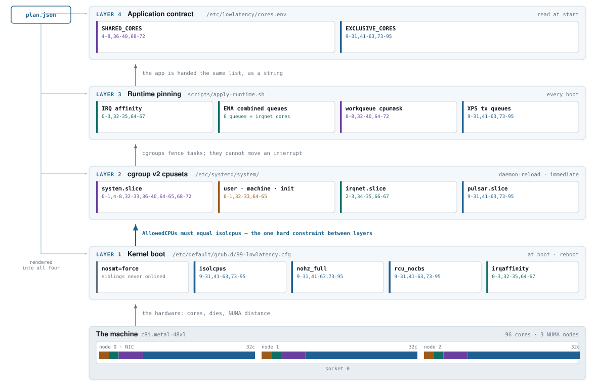
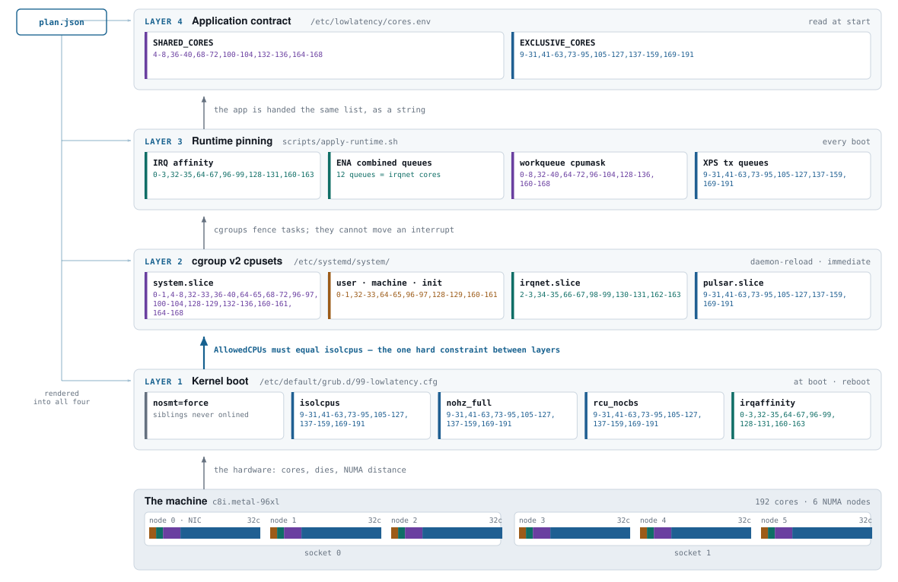
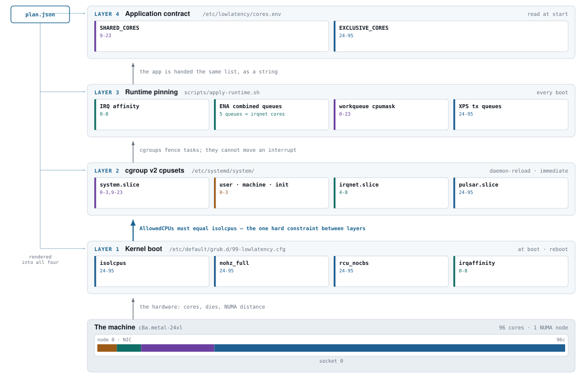
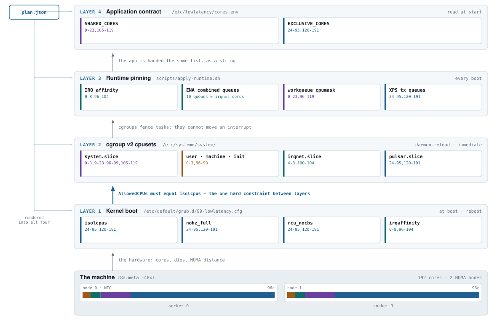

# Proposed configuration, by architecture

One layered diagram per supported metal shape. Each diagram carries that shape's actual
core allocation and the actual configuration values every layer would install — the
kernel arguments, the cgroup cpusets, the runtime pinning targets and the core contract
handed to the application.

Read each diagram upward: the machine at the bottom offers the cores, and each layer
above it describes the same partition through a different kernel mechanism. The arrow
between layers 1 and 2 is the only hard constraint — `AllowedCPUs` must equal `isolcpus`,
and nothing checks it at runtime.

## All seven at a glance

| Architecture | Metal SKU | CPU | Cores | NUMA | housekeeping | irq | shared | **exclusive** |
|---|---|---|---:|---:|---:|---:|---:|---:|
| [`c7i-24xl`](#c7i-24xl) | `c7i.metal-24xl` | Intel Sapphire Rapids | 48 | 1 | 2 | 2 | 7 | **37** |
| [`c7i-48xl`](#c7i-48xl) | `c7i.metal-48xl` | Intel Sapphire Rapids | 96 | 2 | 4 | 4 | 14 | **74** |
| [`c8i-48xl`](#c8i-48xl) | `c8i.metal-48xl` | Intel Xeon 6 (Granite Rapids) | 96 | 3 | 6 | 6 | 15 | **69** |
| [`c8i-96xl`](#c8i-96xl) | `c8i.metal-96xl` | Intel Xeon 6975P-C | 192 | 6 | 12 | 12 | 30 | **138** |
| [`c7a-48xl`](#c7a-48xl) | `c7a.metal-48xl` | AMD EPYC 9R14 (Genoa) | 192 | 2 | 8 | 10 | 30 | **144** |
| [`c8a-24xl`](#c8a-24xl) | `c8a.metal-24xl` | AMD EPYC Turin | 96 | 1 | 4 | 5 | 15 | **72** |
| [`c8a-48xl`](#c8a-48xl) | `c8a.metal-48xl` | AMD EPYC Turin | 192 | 2 | 8 | 10 | 30 | **144** |

Policy: `shared_ratio=0.15`, `min_exclusive_ratio=0.55`, `l3_align=true`, `cstate_max=1`. Housekeeping and IRQ cores are reserved **per NUMA node**, which is why node count and not core count drives the platform's overhead.

## c7i-24xl

**c7i.metal-24xl** · Intel Sapphire Rapids · 1 socket × 48 cores · 96 vCPU → 48 usable · 1 NUMA node (SNC disabled) · L3 domain 48 cores

<picture>
  <source media="(prefers-color-scheme: dark)" srcset="diagrams/c7i-24xl-dark.svg">
  
</picture>

| Role | CPUs | Count | Where it lives |
|---|---|---:|---|
| housekeeping | `0-1` | 2 | `system.slice` + `user`/`machine`/`init` |
| irqnet | `2-3` | 2 | `irqnet.slice` |
| shared | `4-10` | 7 | `system.slice` |
| exclusive | `11-47` | 37 | `pulsar.slice` — isolated |

Per NUMA node:

| Node | Cores | housekeeping | irq | shared | exclusive |
|---:|---:|---|---|---|---|
| 0 · NIC | 48 | `0-1` | `2-3` | `4-10` | `11-47` |

<details><summary>Full kernel command line</summary>

```
nosmt=force
isolcpus=managed_irq,domain,11-47
nohz_full=11-47
rcu_nocbs=11-47
irqaffinity=0-3
nohz=on
numa_balancing=disable
skew_tick=1
nmi_watchdog=0
nosoftlockup
mce=ignore_ce
tsc=reliable
clocksource=tsc
audit=0
rcupdate.rcu_normal_after_boot=1
processor.max_cstate=1
intel_idle.max_cstate=1
cpufreq.default_governor=performance
transparent_hugepage=never
pcie_aspm=off
iommu=pt
systemd.unified_cgroup_hierarchy=1
cgroup_no_v1=all
```
</details>

> **Unverified for this shape:** `numa_nodes` — ASSUMED. SNC is not documented as enabled for SPR on EC2. Confirm with 'lltune topology --live'. Confirm with `lltune topology --live` on first contact.

## c7i-48xl

**c7i.metal-48xl** · Intel Sapphire Rapids · 2 sockets × 48 cores · 192 vCPU → 96 usable · 2 NUMA nodes (SNC disabled) · L3 domain 48 cores

<picture>
  <source media="(prefers-color-scheme: dark)" srcset="diagrams/c7i-48xl-dark.svg">
  
</picture>

| Role | CPUs | Count | Where it lives |
|---|---|---:|---|
| housekeeping | `0-1,48-49` | 4 | `system.slice` + `user`/`machine`/`init` |
| irqnet | `2-3,50-51` | 4 | `irqnet.slice` |
| shared | `4-10,52-58` | 14 | `system.slice` |
| exclusive | `11-47,59-95` | 74 | `pulsar.slice` — isolated |

Per NUMA node:

| Node | Cores | housekeeping | irq | shared | exclusive |
|---:|---:|---|---|---|---|
| 0 · NIC | 48 | `0-1` | `2-3` | `4-10` | `11-47` |
| 1 | 48 | `48-49` | `50-51` | `52-58` | `59-95` |

<details><summary>Full kernel command line</summary>

```
nosmt=force
isolcpus=managed_irq,domain,11-47,59-95
nohz_full=11-47,59-95
rcu_nocbs=11-47,59-95
irqaffinity=0-3,48-51
nohz=on
numa_balancing=disable
skew_tick=1
nmi_watchdog=0
nosoftlockup
mce=ignore_ce
tsc=reliable
clocksource=tsc
audit=0
rcupdate.rcu_normal_after_boot=1
processor.max_cstate=1
intel_idle.max_cstate=1
cpufreq.default_governor=performance
transparent_hugepage=never
pcie_aspm=off
iommu=pt
systemd.unified_cgroup_hierarchy=1
cgroup_no_v1=all
```
</details>

> **Unverified for this shape:** `numa_nodes` — ASSUMED. Confirm with 'lltune topology --live'. Confirm with `lltune topology --live` on first contact.

## c8i-48xl

**c8i.metal-48xl** · Intel Xeon 6 (Granite Rapids) · 1 socket × 96 cores · 192 vCPU → 96 usable · 3 NUMA nodes (SNC3) · L3 domain 32 cores

<picture>
  <source media="(prefers-color-scheme: dark)" srcset="diagrams/c8i-48xl-dark.svg">
  
</picture>

| Role | CPUs | Count | Where it lives |
|---|---|---:|---|
| housekeeping | `0-1,32-33,64-65` | 6 | `system.slice` + `user`/`machine`/`init` |
| irqnet | `2-3,34-35,66-67` | 6 | `irqnet.slice` |
| shared | `4-8,36-40,68-72` | 15 | `system.slice` |
| exclusive | `9-31,41-63,73-95` | 69 | `pulsar.slice` — isolated |

Per NUMA node:

| Node | Cores | housekeeping | irq | shared | exclusive |
|---:|---:|---|---|---|---|
| 0 · NIC | 32 | `0-1` | `2-3` | `4-8` | `9-31` |
| 1 | 32 | `32-33` | `34-35` | `36-40` | `41-63` |
| 2 | 32 | `64-65` | `66-67` | `68-72` | `73-95` |

<details><summary>Full kernel command line</summary>

```
nosmt=force
isolcpus=managed_irq,domain,9-31,41-63,73-95
nohz_full=9-31,41-63,73-95
rcu_nocbs=9-31,41-63,73-95
irqaffinity=0-3,32-35,64-67
nohz=on
numa_balancing=disable
skew_tick=1
nmi_watchdog=0
nosoftlockup
mce=ignore_ce
tsc=reliable
clocksource=tsc
audit=0
rcupdate.rcu_normal_after_boot=1
processor.max_cstate=1
intel_idle.max_cstate=1
cpufreq.default_governor=performance
transparent_hugepage=never
pcie_aspm=off
iommu=pt
systemd.unified_cgroup_hierarchy=1
cgroup_no_v1=all
```
</details>

## c8i-96xl

**c8i.metal-96xl** · Intel Xeon 6975P-C · 2 sockets × 96 cores · 384 vCPU → 192 usable · 6 NUMA nodes (SNC3) · L3 domain 32 cores

<picture>
  <source media="(prefers-color-scheme: dark)" srcset="diagrams/c8i-96xl-dark.svg">
  
</picture>

| Role | CPUs | Count | Where it lives |
|---|---|---:|---|
| housekeeping | `0-1,32-33,64-65,96-97,128-129,160-161` | 12 | `system.slice` + `user`/`machine`/`init` |
| irqnet | `2-3,34-35,66-67,98-99,130-131,162-163` | 12 | `irqnet.slice` |
| shared | `4-8,36-40,68-72,100-104,132-136,164-168` | 30 | `system.slice` |
| exclusive | `9-31,41-63,73-95,105-127,137-159,169-191` | 138 | `pulsar.slice` — isolated |

Per NUMA node:

| Node | Cores | housekeeping | irq | shared | exclusive |
|---:|---:|---|---|---|---|
| 0 · NIC | 32 | `0-1` | `2-3` | `4-8` | `9-31` |
| 1 | 32 | `32-33` | `34-35` | `36-40` | `41-63` |
| 2 | 32 | `64-65` | `66-67` | `68-72` | `73-95` |
| 3 | 32 | `96-97` | `98-99` | `100-104` | `105-127` |
| 4 | 32 | `128-129` | `130-131` | `132-136` | `137-159` |
| 5 | 32 | `160-161` | `162-163` | `164-168` | `169-191` |

<details><summary>Full kernel command line</summary>

```
nosmt=force
isolcpus=managed_irq,domain,9-31,41-63,73-95,105-127,137-159,169-191
nohz_full=9-31,41-63,73-95,105-127,137-159,169-191
rcu_nocbs=9-31,41-63,73-95,105-127,137-159,169-191
irqaffinity=0-3,32-35,64-67,96-99,128-131,160-163
nohz=on
numa_balancing=disable
skew_tick=1
nmi_watchdog=0
nosoftlockup
mce=ignore_ce
tsc=reliable
clocksource=tsc
audit=0
rcupdate.rcu_normal_after_boot=1
processor.max_cstate=1
intel_idle.max_cstate=1
cpufreq.default_governor=performance
transparent_hugepage=never
pcie_aspm=off
iommu=pt
systemd.unified_cgroup_hierarchy=1
cgroup_no_v1=all
```
</details>

## c7a-48xl

**c7a.metal-48xl** · AMD EPYC 9R14 (Genoa) · 2 sockets × 96 cores · 192 vCPU → 192 usable · 2 NUMA nodes (NPS1) · L3 domain 8 cores

<picture>
  <source media="(prefers-color-scheme: dark)" srcset="diagrams/c7a-48xl-dark.svg">
  
</picture>

| Role | CPUs | Count | Where it lives |
|---|---|---:|---|
| housekeeping | `0-3,96-99` | 8 | `system.slice` + `user`/`machine`/`init` |
| irqnet | `4-8,100-104` | 10 | `irqnet.slice` |
| shared | `9-23,105-119` | 30 | `system.slice` |
| exclusive | `24-95,120-191` | 144 | `pulsar.slice` — isolated |

Per NUMA node:

| Node | Cores | housekeeping | irq | shared | exclusive |
|---:|---:|---|---|---|---|
| 0 · NIC | 96 | `0-3` | `4-8` | `9-23` | `24-95` |
| 1 | 96 | `96-99` | `100-104` | `105-119` | `120-191` |

<details><summary>Full kernel command line</summary>

```
isolcpus=managed_irq,domain,24-95,120-191
nohz_full=24-95,120-191
rcu_nocbs=24-95,120-191
irqaffinity=0-8,96-104
nohz=on
numa_balancing=disable
skew_tick=1
nmi_watchdog=0
nosoftlockup
mce=ignore_ce
tsc=reliable
clocksource=tsc
audit=0
rcupdate.rcu_normal_after_boot=1
processor.max_cstate=1
cpufreq.default_governor=performance
transparent_hugepage=never
pcie_aspm=off
iommu=pt
systemd.unified_cgroup_hierarchy=1
cgroup_no_v1=all
```
</details>

> **Unverified for this shape:** `numa_nodes` — ASSUMED NPS1. Confirm with 'lltune topology --live'. Confirm with `lltune topology --live` on first contact.

## c8a-24xl

**c8a.metal-24xl** · AMD EPYC Turin · 1 socket × 96 cores · 96 vCPU → 96 usable · 1 NUMA node (NPS1) · L3 domain 8 cores

<picture>
  <source media="(prefers-color-scheme: dark)" srcset="diagrams/c8a-24xl-dark.svg">
  
</picture>

| Role | CPUs | Count | Where it lives |
|---|---|---:|---|
| housekeeping | `0-3` | 4 | `system.slice` + `user`/`machine`/`init` |
| irqnet | `4-8` | 5 | `irqnet.slice` |
| shared | `9-23` | 15 | `system.slice` |
| exclusive | `24-95` | 72 | `pulsar.slice` — isolated |

Per NUMA node:

| Node | Cores | housekeeping | irq | shared | exclusive |
|---:|---:|---|---|---|---|
| 0 · NIC | 96 | `0-3` | `4-8` | `9-23` | `24-95` |

<details><summary>Full kernel command line</summary>

```
isolcpus=managed_irq,domain,24-95
nohz_full=24-95
rcu_nocbs=24-95
irqaffinity=0-8
nohz=on
numa_balancing=disable
skew_tick=1
nmi_watchdog=0
nosoftlockup
mce=ignore_ce
tsc=reliable
clocksource=tsc
audit=0
rcupdate.rcu_normal_after_boot=1
processor.max_cstate=1
cpufreq.default_governor=performance
transparent_hugepage=never
pcie_aspm=off
iommu=pt
systemd.unified_cgroup_hierarchy=1
cgroup_no_v1=all
```
</details>

> **Unverified for this shape:** `cores_per_l3` — ASSUMED classic Zen 5 (8-core CCX). The 4.5 GHz max frequency points to classic rather than Zen 5c dense, which would be 16. Confirm with --live: it moves where the exclusive block starts.; `numa_nodes` — ASSUMED NPS1. Confirm with 'lltune topology --live'. Confirm with `lltune topology --live` on first contact.

## c8a-48xl

**c8a.metal-48xl** · AMD EPYC Turin · 2 sockets × 96 cores · 192 vCPU → 192 usable · 2 NUMA nodes (NPS1) · L3 domain 8 cores

<picture>
  <source media="(prefers-color-scheme: dark)" srcset="diagrams/c8a-48xl-dark.svg">
  
</picture>

| Role | CPUs | Count | Where it lives |
|---|---|---:|---|
| housekeeping | `0-3,96-99` | 8 | `system.slice` + `user`/`machine`/`init` |
| irqnet | `4-8,100-104` | 10 | `irqnet.slice` |
| shared | `9-23,105-119` | 30 | `system.slice` |
| exclusive | `24-95,120-191` | 144 | `pulsar.slice` — isolated |

Per NUMA node:

| Node | Cores | housekeeping | irq | shared | exclusive |
|---:|---:|---|---|---|---|
| 0 · NIC | 96 | `0-3` | `4-8` | `9-23` | `24-95` |
| 1 | 96 | `96-99` | `100-104` | `105-119` | `120-191` |

<details><summary>Full kernel command line</summary>

```
isolcpus=managed_irq,domain,24-95,120-191
nohz_full=24-95,120-191
rcu_nocbs=24-95,120-191
irqaffinity=0-8,96-104
nohz=on
numa_balancing=disable
skew_tick=1
nmi_watchdog=0
nosoftlockup
mce=ignore_ce
tsc=reliable
clocksource=tsc
audit=0
rcupdate.rcu_normal_after_boot=1
processor.max_cstate=1
cpufreq.default_governor=performance
transparent_hugepage=never
pcie_aspm=off
iommu=pt
systemd.unified_cgroup_hierarchy=1
cgroup_no_v1=all
```
</details>

> **Unverified for this shape:** `cores_per_l3` — ASSUMED classic Zen 5 (8-core CCX). Confirm with --live.; `numa_nodes` — ASSUMED NPS1. Confirm with 'lltune topology --live'. Confirm with `lltune topology --live` on first contact.

---

The verbatim contents of every file these layers install are in [`CONFIG-REFERENCE.md`](CONFIG-REFERENCE.md). On a host, `./scripts/apply.sh` plans from the real topology and shows the diff before anything is written.
